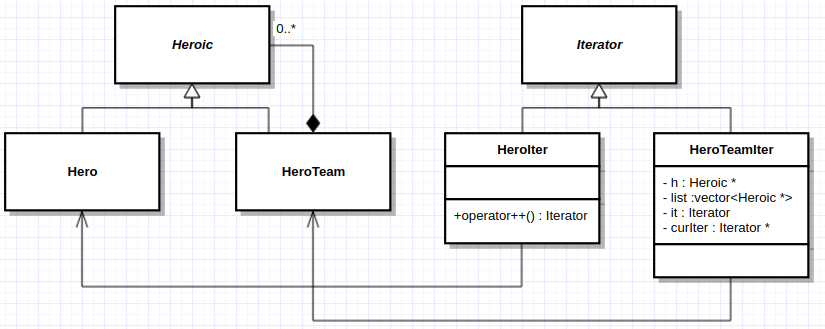

Adding onto the example of last class:



We want to iterate through a HeroTeam
```cpp
Iterator & HeroTeamIter::operator++() {
  if(h) {
    h = nullptr;
  } else {
    if(*curIte == (*it)->end()) {
      ++(*it);
    } else 
      ++curIter;
    }
  }
  return *this;
}

bool HeroTeamIter::operator!=(const Iterator & o) {
  return h == o.h && *it == *o.it && curIter == o.curIter;
}
```
- *BAD*: `Iterator` has no `h`,`it` or `curIter` fields. How can we solve this?
- Make `operator!=` non virtual???
- NO, we don't want to loose our polymorphic behaviour.
- To solve this problem, we have to do a bad thing that you shouldn't do.
## Aside on casting:
### Casting in C
```c
Node n;
int *ip = (int*)&n;
```
This is a c-style cast, it tells the compiler to treat a Node* as an int*

- Casts in C++ should be avoided, and in particular, C-style casts should be avoided. 
- If you must cast, use one of the 4 flavours of C++ style casting:
  - `static_cast` is for a "sensible casts" between types where conversion has well defined behaviour.
    - **Example**: double to int `double d; int i = static_cast<int>(d);`
    - Derived class pointer to superclass ptr (**upcast**)
      - **Example**: `Hero * h; Heroic * heroic = h;`
      - It is implicit
    - Superclass ptr, to a derived class ptr (**downcast**)
```cpp
Heroic * h = new Hero();
Hero * hero = static_cast<Hero*>(h);
Hero * h2 = new HeroTeam();
Hero * hero2 = static_cast<Hero*>(h2);
```
    - You run into problems doing this...
    - You are telling the compiler "trust me, I know what I'm doing" which is dangerous.
---
- This doesn't solve our problem, it mearly pushes it around.
- We can make HeroTeamIter::operator!= compile, but it's still incorrect.
```cpp
bool HeroTeamIter::operator!=(const Iterator & o) {
  HeroTeamIter * p = static_cast<HeroTeamIter*>(&o);
  // same return as before but with p-> instead of o.
}
```
- This will compile and sometimes even work, but it's still broken.
```cpp
HeroTeam t{...};
Hero h{...};
t.begin() != h.begin();
```
- Try to use `HeroIter*` as `HeroTeamIter*`
- Problem still not solved.
## Aside on casting pt2 : electric boogaloo
- `reinterpret_cast` is for unsafe, interpretation dependant "weird" conversions.
  - Nearly all uses of `reinterpret_cast` result in undefined behaviour.
```cpp
Student s;
Turtle *t = reinterpret_casst<Turtle*>(&s);
```
  - Forcing a student to be treated as a turtle.
  - **DO NOT USE IT**
- `const_cast` is for converting between constant and non constant. It is the *only* C++ cast that can cast away constants.
```cpp
void g(int *p) // we know that this doesn't modify p for some reason
void f(const int *p) {
  g(const_cast<int*>(p));
  ...
}
```

